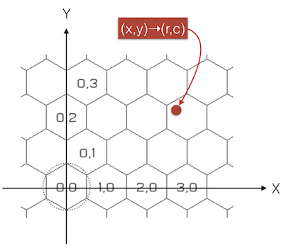

# Hex Grid

Simple [scala](http://www.scala-lang.org/) based library to compute the row/column pair of a planar x/y value on a hexagonal grid.



Given a row/column pair, you can get back the x/y center of the [hexagon](http://en.wikipedia.org/wiki/Hexagon) at the specified row/column values.

The hexagon grid is defined by a uniform cell size and an origin.

* The cell size is the *radius* of the circle that overlaps the vertices of a hexagon in the grid.

* The origin is an optional definition that can be used to offset the input x/y values to produce positive row/column values.

### Building the project

This project uses [SBT](http://www.scala-sbt.org) to build the project, and is published as a [Maven](http://maven.apache.org) artifact that will reside in your local maven repo.

```shell
> sbt publish
```

#### Using Maven

```shell
> mvn install
```

### Sample Usage

```shell
> scala -classpath hex-grid_2.10-1.0.jar
```

```scala
scala> import com.esri.hex._
import com.esri.hex._

scala> val hexGrid = HexGrid(100)
hexGrid: com.esri.hex.HexGrid = HexGrid(100.0,0.0,0.0)

scala> val rowcol = hexGrid.convertXYToRowCol(110,120)
rowcol: com.esri.hex.HexRowCol = HexRowCol(1,0)

scala> val encode = rowcol.toLong
encode: Long = 4294967296

scala> hexGrid.convertRowColToHexXY(rowcol)
res4: com.esri.hex.HexXY = Hex00()

scala> val xy = hexGrid.convertRowColToHexXY(rowcol)
xy: com.esri.hex.HexXY = Hex00()

scala> println(xy.x)
86.60254037844388

scala> println(xy.y)
150.0
```
